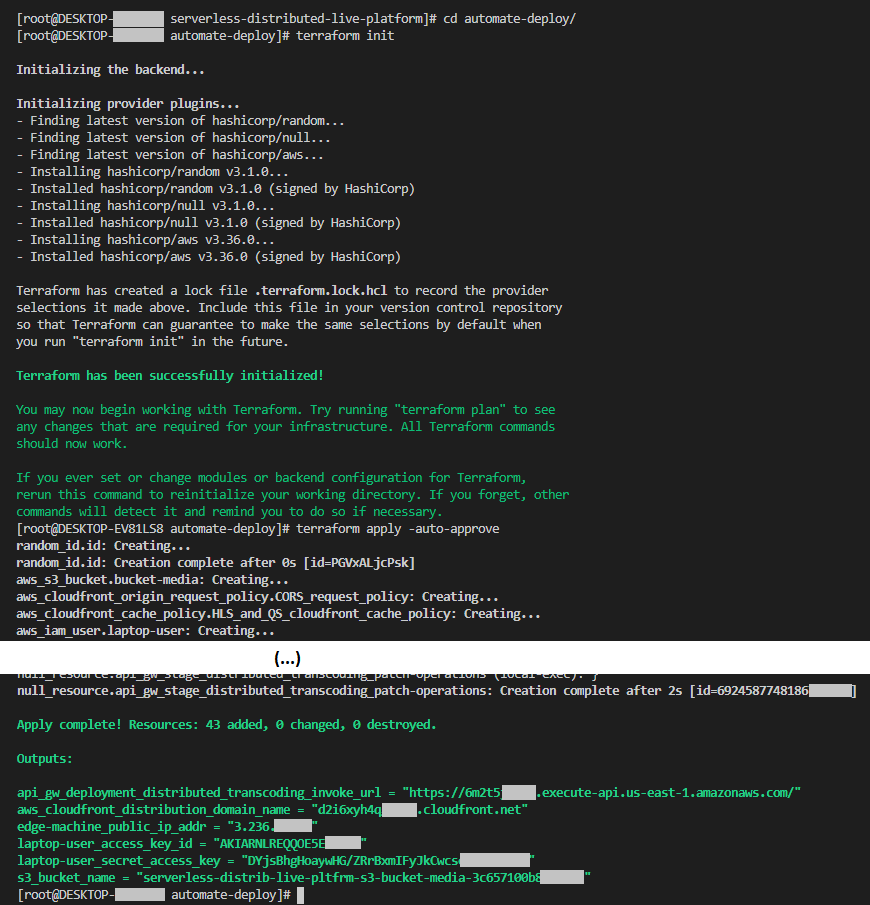
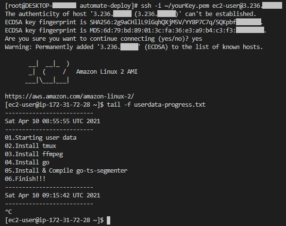

# Serverless distributed live platform - Automated deploy

The code available in this folder allows you to automatically deploy the [serverless distributed live platform](https://github.com/jordicenzano/serverless-distributed-live-platform) using [Terraform by HashiCorp](https://www.terraform.io/).

# Deploy the environment
This Terraform code is designed to automate the 10 steps detailed in the [Set up the environment procedure](./../README.md#set-up-the-environment) main README.

## Prerequisites
We are assuming you have [AWS CLI](https://aws.amazon.com/cli/) installed and configured properly in your system.

We are also asuming you have [Terraform CLI](https://www.terraform.io/downloads.html) installed and configured properly in your system.

In the `automate-deploy/secrets` folder you must place the ssh-rsa public key `yourKey.pub` that will be injected in the EC2 edge machine. After the deployment of the environment, you will be able to SSH into the edge machine with the appropriate private key `yourKey.pem`:
```bash
  ssh -i yourKey.pem ec2-user@EC2-IP`
```

## Deploy the environment
Execute he following commands to **deploy** the environment:
```bash
cd automate-deploy
terraform init
terraform apply -auto-approve
```
*Note: Sometimes the deployment process finishes with an error due to some dependencies creation timeout. Execute again the `terraform apply -auto-approve` command to finish successfully the deployment of the environment.*

### Environment outputs
After the deployment process, the information of the main created resources will be available:



*Figure 1: OUTPUTS => Main resources' information after "terraform apply"*

### Waiting for the EC2 edge machine to be ready
The the EC2 edge machine takes about 20 minutes to be installed and configured properly.

You have to wait until the whole process is finished:
```bash
tail -f userdata-progress.txt
```



*Figure 2: OUTPUTS => EC2 edge machine initialitzation progress (exit tail command with 'Ctrl+C' when it's ready)*

### Test / Demo
Follow the [Test / Demo](./../README.md##test--demo) instruccions of the main README to do some initial tests.

## Destroy the environment
Execute he following commands to **destroy** the environment:
```bash
terraform destroy -auto-approve
```
